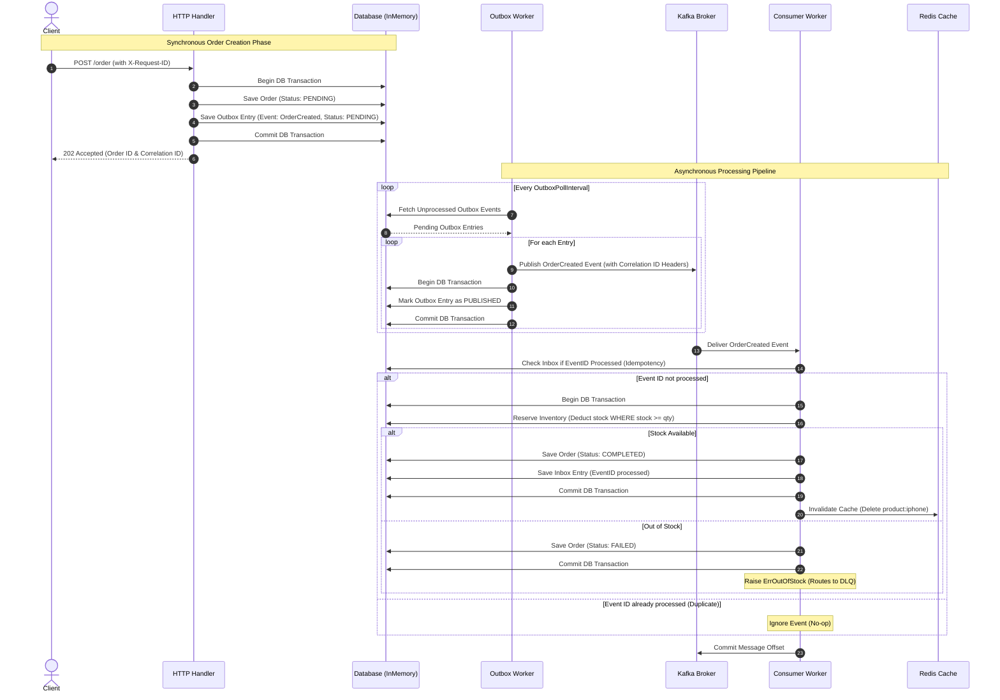

# Kafka-Redis Hexagonal Microservice Demo

A production-ready implementation of an event-driven inventory and order processing microservice in Go. This repository demonstrates how to build microservices using **Clean Architecture / Hexagonal Architecture** principles, enforcing clean layer boundaries, structured dependency injection, and advanced distributed systems reliability patterns.

---

## Architecture Overview

The codebase is organized following **Hexagonal Architecture** (also known as Ports & Adapters). Core business logic is isolated from external triggers, protocols, transport configurations, and storage details.

```
├── main.go                       # Application bootstrap (Wiring, Dependency Injection, Graceful Shutdown)
├── go.mod
├── go.sum
├── README.md                     # Documentation
└── internal/
    ├── config/
    │   └── config.go             # App settings (struct-based configuration)
    ├── domain/
    │   └── models.go             # Core Domain aggregates (Product, Order) and typed errors
    ├── ports/
    │   └── ports.go              # Interfaces (Contracts for DB, Cache, Broker, Logger, Metrics)
    ├── logger/
    │   └── logger.go             # Structured Logging wrapper (JSON slog with context correlation ID)
    ├── metrics/
    │   └── metrics.go            # Custom atomic metrics trackers (observability)
    ├── service/
    │   └── service.go            # Business Use Cases (order placement, inventory allocation)
    ├── adapters/
    │   ├── repository/
    │   │   └── inmemory.go       # InMemory DB with serialized snapshot isolation transactions
    │   ├── cache/
    │   │   └── redis.go          # Redis client cache-aside adapter
    │   ├── kafka/
    │   │   ├── publisher.go      # Kafka producer adapter (implements EventPublisher, DLQPublisher)
    │   │   └── consumer.go       # Kafka consumer worker pool with retries and offsets commit
    │   └── http/
    │       └── handlers.go       # HTTP server endpoints & Correlation ID middleware
    └── worker/
        └── outbox.go             # Background outbox publisher worker
```

### Core Architecture Boundaries
1. **Domain Layer (`internal/domain`)**: Contains the core business entities and rules. It has zero external dependencies and imports no other internal packages.
2. **Ports Layer (`internal/ports`)**: Defines the interface boundaries. The core business service talks only to these interfaces, ensuring storage, broker, and caching solutions can be swapped transparently.
3. **Service Layer (`internal/service`)**: Orchestrates use cases (e.g., `CreateOrder`, `ProcessOrderCreated`). It contains zero Kafka, Redis, or HTTP protocol code, keeping business rules pure and unit-testable.
4. **Adapters Layer (`internal/adapters`)**: Bridges technology-specific protocols (Kafka, Redis, HTTP, SQL databases) to the core ports interfaces.
5. **Main Bootstrap (`main.go`)**: The composition root. It loads config, instantiates adapters, wires dependencies via constructor injection, starts background threads, and intercepts OS signals for graceful termination.

---

## Transaction Scenario & Data Flow

This microservice showcases the **Outbox Pattern** and the **Inbox Pattern** working together to achieve **At-Least-Once Delivery** and **Exactly-Once Processing** without expensive distributed two-phase commits (2PC).




-------------------------------

```
[Client] 
   │
   │ (1) POST /order with X-Request-ID
   ▼
[HTTP Middleware] (Generates & injects Correlation ID into context)
   │
   ▼
[OrderService.CreateOrder] 
   │
   ├──► [Begin DB Transaction]
   │       ├── (2) Insert Order (Status: PENDING)
   │       └── (3) Insert Outbox Entry (Event: OrderCreated, Correlation ID)
   ├──► [Commit Transaction]
   ▼
[HTTP Response: 202 Accepted]

==================== ASYNCHRONOUS PIPELINE ====================

[Outbox Worker] (Polls database on background ticker)
   │
   ├── (4) Fetches PENDING outbox events
   ├── (5) Publishes event to Kafka (with Correlation ID in headers)
   ├── (6) DB Tx: Marks Outbox event as PUBLISHED
   ▼
[Kafka Broker] (orders topic)
   │
   ▼
[Kafka Consumer Group]
   │
   ▼
[Worker Pool (Worker 1..N)] (Extracts Correlation ID from message headers)
   │
   ▼
[OrderService.ProcessOrderCreated]
   │
   ├──► [Begin DB Transaction]
   │       ├── (7) Check Inbox if EventID already exists (Idempotency)
   │       │         ├── Yes: Skip (Duplicate No-Op)
   │       │         └── No: Proceed
   │       ├── (8) Reserve Inventory (Atomic query: SET stock = stock - qty WHERE stock >= qty)
   │       │         └── Out of Stock: DB Tx: Mark Order FAILED -> Commit -> Return error
   │       ├── (9) Update Order (Status: COMPLETED)
   │       └── (10) Insert Inbox Entry (EventID processed)
   ├──► [Commit Transaction]
   │
   ├── (11) Invalidate Product Cache (Redis Delete: cache product:<name>)
   ▼
[Done]
```

---

## Deep Dive: Key Resilience Patterns

### 1. The Transactional Outbox Pattern
Writing to a database and publishing to a message broker are not naturally atomic. If the broker is down, the database commit succeeds but the message is lost. If the database commit fails but publishing succeeds, the system is inconsistent.
* **Solution:** We record the event inside the database (`outbox` collection/table) as part of the same transaction that registers the order.
* **Polling Worker:** A background [OutboxWorker](file:///Users/williamhuang/Documents/backend/kafka-redis-demo/internal/worker/outbox.go) polls for pending events, publishes them to Kafka with exponential retries, and marks them as published.

### 2. The Inbox Pattern (Idempotency)
Networks fail and message brokers redeliver messages. The consumer must assume it will receive messages multiple times.
* **Solution:** The [OrderService](file:///Users/williamhuang/Documents/backend/kafka-redis-demo/internal/service/service.go) writes every successfully processed `event_id` into the `inbox` table. Subsequent deliveries of the same event ID are caught by the inbox checker and skipped immediately, preventing double deduction.

### 3. Cache-Aside Pattern
Retrieving inventory from a database can bottleneck under high traffic.
* **Solution:** Read calls check Redis first. If it misses, they load from the database and write back to Redis (with a TTL).
* **Write Invalidation:** When stock changes, the cache entry is immediately deleted.
* **Resilience:** If Redis is down, the system logs a warning and fails open directly to the database, ensuring zero downtime.

### 4. Exponential Backoff Retries & Dead Letter Queue (DLQ)
* **Backoff:** Operations like Kafka publishing and event processing are wrapped in retry utilities that double the backoff delay on each consecutive failure.
* **DLQ:** If transient retries are exhausted, or a permanent business constraint is violated (e.g. `ErrOutOfStock`), the consumer worker publishes the failed message payload into a dead letter queue topic (e.g. `orders-dlq`) with error diagnostics mapped into the message headers, then commits the offset to avoid blocking partition consumption.

### 5. Graceful Shutdown
Upon SIGINT or SIGTERM:
1. The HTTP server rejects new incoming connections.
2. Background outbox workers and consumer pools complete in-flight transactions.
3. Decoupled offsets are committed safely.
4. Message broker connections and Redis client wrappers are gracefully closed.

---

## Getting Started

### Prerequisites
* Go 1.21+ (built using Go 1.26 features)
* Docker & Docker Compose (optional for integration testing)

### Run the App Local Infrastructure
To spin up Redis and Kafka brokers locally:
```bash
docker-compose up -d
```

To run the application:
```bash
go run main.go
```

---

## Verification & Testing

This project comes with a comprehensive, concurrent, thread-safe test suite in [main_test.go](file:///Users/williamhuang/Documents/backend/kafka-redis-demo/main_test.go). It runs fully in-memory by injecting mocks and fakes for external dependencies (caching, brokers), avoiding unstable sleep loops.

Run the test suite with Go's race detector enabled:
```bash
go test -v -race ./...
```